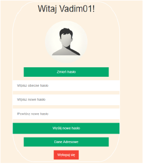
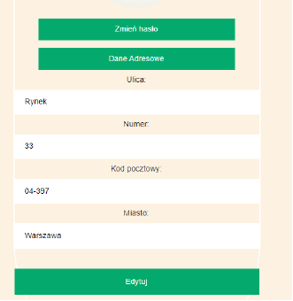
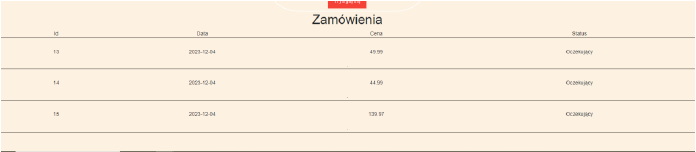
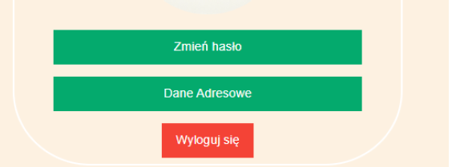
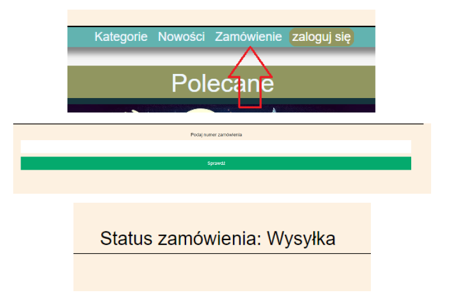
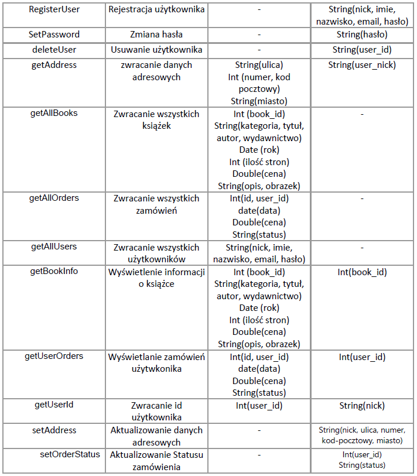

# BookStore
Website featuring online bookstores

## Table of contents
* [General info](#BookStore)
* [User features](#user-features)
* [Admin features](#admin-features)
* [Database](#database)
# User features
## browsing the site

## filtering books by category

## browsing books from a given category

## viewing a book's card

## clicking the add to cart button

## cart management

## viewing cart details

## removing book from the cart

## submit an order

## registration

## login

## password change (after loggin)

## address change (after loggin)

## check all your orders (after loggin)

## logout

## Check order status

# Admin features

# Database
# functions

# procedures

# triggers

